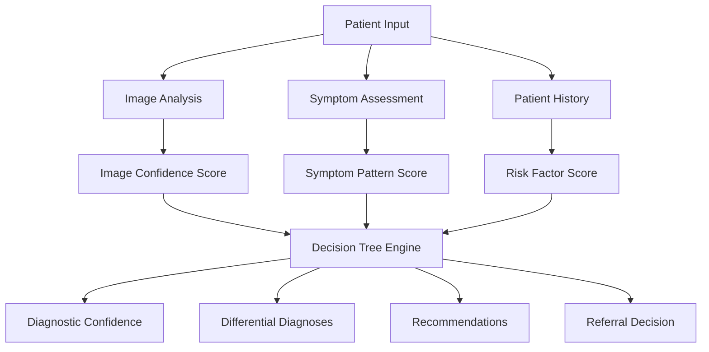

# Decision Tree Framework for Ear Diagnosis System

## Overview

The decision tree framework combines image classification, symptom assessment, and patient history to provide evidence-based diagnostic recommendations. This multi-modal approach mimics clinical decision-making processes used by ENT specialists.

## Framework Architecture

### Three-Tier Evidence System



## Component 1: Image Classification Evidence

### Confidence Scoring
```python
def calculate_image_evidence(predictions):
    """
    Convert model predictions to evidence strength
    
    Args:
        predictions: Dict of class probabilities
        
    Returns:
        dict: Evidence scores and confidence metrics
    """
    max_prob = max(predictions.values())
    top_class = max(predictions, key=predictions.get)
    
    # Confidence categories
    if max_prob >= 0.85:
        confidence_level = "HIGH"
        evidence_weight = 1.0
    elif max_prob >= 0.65:
        confidence_level = "MEDIUM" 
        evidence_weight = 0.7
    elif max_prob >= 0.45:
        confidence_level = "LOW"
        evidence_weight = 0.4
    else:
        confidence_level = "INSUFFICIENT"
        evidence_weight = 0.1
    
    return {
        'top_prediction': top_class,
        'probability': max_prob,
        'confidence_level': confidence_level,
        'evidence_weight': evidence_weight,
        'differential': sorted(predictions.items(), 
                             key=lambda x: x[1], reverse=True)[:3]
    }
```

### Image Evidence Rules
- **HIGH (≥0.85)**: Strong supporting evidence for diagnosis
- **MEDIUM (0.65-0.84)**: Moderate supporting evidence  
- **LOW (0.45-0.64)**: Weak evidence, consider other modalities
- **INSUFFICIENT (<0.45)**: Rely primarily on symptoms and history

## Component 2: Symptom Pattern Matching

### Symptom-Disease Associations
```python
CLINICAL_PATTERNS = {
    'Acute_Otitis_Media': {
        'mandatory_symptoms': ['ear_pain'],
        'supporting_symptoms': ['fever', 'hearing_reduction', 'irritability'],
        'temporal_pattern': {'onset': 'acute', 'duration': '<2_weeks'},
        'age_factors': {'high_risk': '6m_to_3y', 'moderate_risk': '<6y'},
        'severity_indicators': ['high_fever', 'severe_pain', 'bulging_membrane']
    },
    
    'Chronic_Otitis_Media': {
        'mandatory_symptoms': ['hearing_reduction'],
        'supporting_symptoms': ['intermittent_discharge', 'ear_fullness'],
        'temporal_pattern': {'duration': '>3_months', 'recurrent': True},
        'complications': ['cholesteatoma', 'ossicular_damage'],
        'severity_indicators': ['persistent_discharge', 'conductive_loss']
    },
    
    'Otitis_Externa': {
        'mandatory_symptoms': ['ear_pain_on_touch'],
        'supporting_symptoms': ['itching', 'discharge', 'canal_swelling'],
        'temporal_pattern': {'onset': 'gradual', 'triggers': 'water_exposure'},
        'risk_factors': ['swimming', 'humid_climate', 'hearing_aids'],
        'severity_indicators': ['severe_swelling', 'cellulitis']
    },
    
    'Cerumen_Impaction': {
        'mandatory_symptoms': ['hearing_reduction'],
        'supporting_symptoms': ['ear_fullness', 'tinnitus'],
        'temporal_pattern': {'onset': 'gradual', 'progressive': True},
        'risk_factors': ['hearing_aids', 'narrow_canals', 'excessive_cleaning'],
        'severity_indicators': ['complete_blockage', 'dizziness']
    },
    
    'Normal_Tympanic_Membrane': {
        'exclusion_criteria': ['pain', 'discharge', 'hearing_loss', 'fever'],
        'compatible_symptoms': ['mild_fullness', 'recent_URI'],
        'temporal_pattern': {'stable': True, 'no_progression': True}
    }
}
```

### Symptom Scoring Algorithm
```python
def calculate_symptom_score(reported_symptoms, condition):
    """
    Calculate symptom-pattern match score for specific condition
    """
    pattern = CLINICAL_PATTERNS[condition]
    score = 0.0
    max_score = 0.0
    
    # Mandatory symptoms (high weight)
    mandatory_weight = 0.4
    if 'mandatory_symptoms' in pattern:
        for symptom in pattern['mandatory_symptoms']:
            max_score += mandatory_weight
            if symptom in reported_symptoms and reported_symptoms[symptom]:
                score += mandatory_weight
    
    # Supporting symptoms (moderate weight) 
    supporting_weight = 0.2
    if 'supporting_symptoms' in pattern:
        for symptom in pattern['supporting_symptoms']:
            max_score += supporting_weight
            if symptom in reported_symptoms and reported_symptoms[symptom]:
                score += supporting_weight
    
    # Temporal pattern (moderate weight)
    temporal_weight = 0.3
    if 'temporal_pattern' in pattern:
        max_score += temporal_weight
        if matches_temporal_pattern(reported_symptoms, pattern['temporal_pattern']):
            score += temporal_weight
    
    # Severity indicators (bonus points)
    severity_bonus = 0.1
    if 'severity_indicators' in pattern:
        for indicator in pattern['severity_indicators']:
            if indicator in reported_symptoms and reported_symptoms[indicator]:
                score += severity_bonus
    
    return min(score / max_score if max_score > 0 else 0, 1.0)
```

## Component 3: Patient History and Risk Factors

### Risk Factor Categories
```python
RISK_FACTORS = {
    'demographic': {
        'age_pediatric': {'conditions': ['AOM', 'COM'], 'multiplier': 1.3},
        'age_elderly': {'conditions': ['Cerumen'], 'multiplier': 1.2},
        'male_gender': {'conditions': ['Otitis_Externa'], 'multiplier': 1.1}
    },
    
    'medical_history': {
        'previous_ear_infections': {
            'conditions': ['COM', 'AOM_recurrent'], 
            'multiplier': 1.4
        },
        'allergies': {
            'conditions': ['Otitis_Externa', 'AOM'], 
            'multiplier': 1.2
        },
        'immunocompromised': {
            'conditions': ['Otitis_Externa', 'COM'],
            'multiplier': 1.5
        }
    },
    
    'environmental': {
        'swimming_exposure': {
            'conditions': ['Otitis_Externa'], 
            'multiplier': 2.0
        },
        'hearing_aid_use': {
            'conditions': ['Cerumen', 'Otitis_Externa'],
            'multiplier': 1.6
        },
        'recent_URI': {
            'conditions': ['AOM'],
            'multiplier': 1.3
        }
    }
}
```

### History Scoring
```python
def calculate_history_score(patient_history, condition):
    """
    Calculate risk factor score for specific condition
    """
    base_score = 0.5  # Neutral baseline
    multipliers = []
    
    for category, factors in RISK_FACTORS.items():
        for factor, properties in factors.items():
            if (condition in properties['conditions'] and 
                factor in patient_history and 
                patient_history[factor]):
                multipliers.append(properties['multiplier'])
    
    # Apply multiplicative risk factors
    for multiplier in multipliers:
        base_score *= multiplier
    
    return min(base_score, 1.0)
```

## Decision Tree Logic

### Primary Decision Algorithm
```python
def diagnose_patient(image_evidence, symptoms, patient_history):
    """
    Main diagnostic decision tree
    """
    
    # Calculate component scores for each condition
    conditions = list(CLINICAL_PATTERNS.keys())
    condition_scores = {}
    
    for condition in conditions:
        # Weighted combination of evidence
        image_score = image_evidence.get(condition, 0) * 0.40
        symptom_score = calculate_symptom_score(symptoms, condition) * 0.35
        history_score = calculate_history_score(patient_history, condition) * 0.25
        
        total_score = image_score + symptom_score + history_score
        condition_scores[condition] = total_score
    
    # Apply clinical decision rules
    diagnosis = apply_clinical_rules(condition_scores, symptoms, patient_history)
    
    return diagnosis

def apply_clinical_rules(scores, symptoms, history):
    """
    Apply clinical decision rules and safety checks
    """
    
    # Rule 1: Red flag symptoms require immediate referral
    red_flags = check_red_flags(symptoms, history)
    if red_flags:
        return {
            'decision': 'IMMEDIATE_REFERRAL',
            'reason': 'Red flag symptoms detected',
            'red_flags': red_flags,
            'urgency': 'URGENT'
        }
    
    # Rule 2: High confidence diagnosis (>0.85)
    top_condition = max(scores, key=scores.get)
    top_score = scores[top_condition]
    
    if top_score >= 0.85:
        return {
            'primary_diagnosis': top_condition,
            'confidence': 'HIGH',
            'score': top_score,
            'action': 'TREAT',
            'differential': get_differential_diagnoses(scores, n=2)
        }
    
    # Rule 3: Moderate confidence (0.65-0.84)
    elif top_score >= 0.65:
        return {
            'probable_diagnosis': top_condition,
            'confidence': 'MODERATE', 
            'score': top_score,
            'action': 'MONITOR_OR_TREAT',
            'differential': get_differential_diagnoses(scores, n=3),
            'follow_up': 'Reassess in 48-72 hours'
        }
    
    # Rule 4: Low confidence (<0.65)
    else:
        return {
            'confidence': 'LOW',
            'score': top_score,
            'action': 'CLINICAL_EXAMINATION',
            'differential': get_differential_diagnoses(scores, n=4),
            'recommendation': 'Professional evaluation recommended'
        }
```

### Red Flag Detection
```python
def check_red_flags(symptoms, history):
    """
    Identify symptoms requiring immediate medical attention
    """
    red_flags = []
    
    # Severe symptoms
    if symptoms.get('severe_pain', False) and symptoms.get('high_fever', False):
        red_flags.append('Severe acute otitis media')
    
    if symptoms.get('facial_weakness', False):
        red_flags.append('Possible facial nerve involvement')
    
    if symptoms.get('severe_dizziness', False) or symptoms.get('balance_problems', False):
        red_flags.append('Possible inner ear involvement')
    
    if symptoms.get('severe_headache', False) and symptoms.get('neck_stiffness', False):
        red_flags.append('Possible intracranial complication')
    
    # High-risk patient factors
    if history.get('immunocompromised', False) and symptoms.get('ear_discharge', False):
        red_flags.append('Immunocompromised patient with active infection')
    
    if history.get('diabetes', False) and symptoms.get('severe_otitis_externa', False):
        red_flags.append('Risk of malignant otitis externa')
    
    return red_flags
```

## Clinical Decision Support Features

### Treatment Recommendations
```python
TREATMENT_GUIDELINES = {
    'Acute_Otitis_Media': {
        'first_line': 'Amoxicillin 80-90mg/kg/day',
        'penicillin_allergy': 'Azithromycin or Ceftriaxone',
        'duration': '10 days (under 2y), 7 days (over 2y)',
        'pain_management': 'Ibuprofen or acetaminophen',
        'follow_up': '48-72 hours if no improvement'
    },
    
    'Otitis_Externa': {
        'first_line': 'Topical antibiotic drops',
        'severe_cases': 'Systemic antibiotics + topical',
        'pain_management': 'Analgesics, ear wick if severe',
        'prevention': 'Keep ears dry, avoid cotton swabs'
    },
    
    'Cerumen_Impaction': {
        'first_line': 'Cerumen softening agents',
        'manual_removal': 'If symptomatic and failed medical',
        'prevention': 'Avoid cotton swabs, regular cleaning'
    }
}
```

### Follow-up Protocols
```python
def generate_follow_up_plan(diagnosis):
    """
    Generate appropriate follow-up recommendations
    """
    if diagnosis['confidence'] == 'HIGH':
        if diagnosis['primary_diagnosis'] == 'Acute_Otitis_Media':
            return {
                'timeline': '48-72 hours',
                'criteria': 'If symptoms worsen or no improvement',
                'action': 'Consider antibiotic change or ENT referral'
            }
    
    elif diagnosis['confidence'] == 'MODERATE':
        return {
            'timeline': '24-48 hours',
            'criteria': 'Monitor symptom progression',
            'action': 'Reassess and consider treatment initiation'
        }
    
    else:  # LOW confidence
        return {
            'timeline': 'As soon as possible',
            'action': 'Professional clinical examination',
            'urgency': 'Within 24 hours for symptomatic patients'
        }
```

## Validation and Quality Assurance

### Decision Tree Validation
- **Clinical Case Reviews**: ENT specialist validation of decision logic
- **Retrospective Analysis**: Test against known diagnostic outcomes
- **Sensitivity Analysis**: Vary weights and thresholds
- **Edge Case Testing**: Unusual presentations and combinations

### Continuous Learning
- **Feedback Loop**: Incorporate clinical outcomes into model refinement
- **Pattern Recognition**: Identify new symptom-disease associations
- **Threshold Optimization**: Adjust confidence thresholds based on performance
- **Regional Adaptation**: Modify for local disease prevalence and practices

## Implementation Considerations

### Safety Measures
1. **Conservative Thresholds**: Err on side of referral for patient safety
2. **Clear Disclaimers**: Emphasize tool limitations and need for clinical judgment
3. **Audit Trail**: Log all decisions for review and improvement
4. **Expert Override**: Allow clinician override of system recommendations

### User Interface Integration
- **Visual Decision Tree**: Show reasoning process to users
- **Confidence Indicators**: Clear display of certainty levels
- **Alternative Diagnoses**: Present differential diagnoses with reasoning
- **Educational Content**: Provide information about conditions and treatments